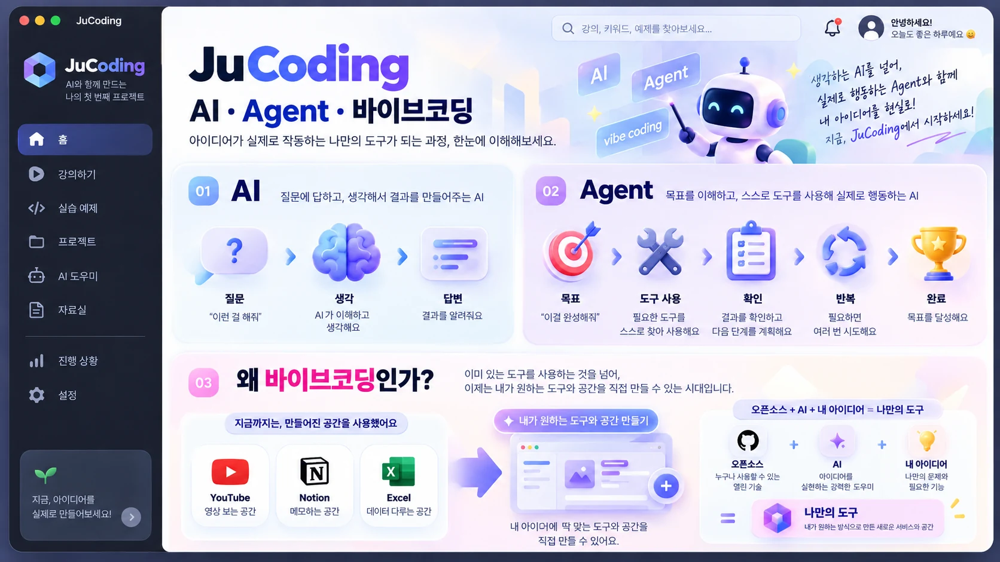

<p align="center">
  
</p>

<h1 align="center">JuCoding</h1>

<p align="center">
  
  
  
</p>

<p align="center">
  <b>AI · Agent · 바이브코딩을 시각적으로 가르치는 Electron 기반 강의 스튜디오</b>
</p>

---

## 소개

JuCoding은 초보자용 3시간 강의 **AI · Agent · 바이브코딩**을 진행하는 데스크톱 앱입니다.

21개 장면으로 이루어진 한 개의 강의와, 장면 안에서 개념이 실제로 동작하는 과정을 보여주는 **인터랙티브 시뮬레이션**, 그리고 강의 내용을 코드를 고치지 않고 갱신할 수 있는 **Archive 자료함**을 제공합니다.

인터넷 없이 동작합니다.

## 화면 구조

- **홈** — 오늘의 강의, 실습 예제, 프로젝트 메모, 자료실, AI 도우미, 강사 도구
- **강의** — 6개 흐름 + 안전 수업, 총 21개 장면
- **자료실** — 수업용 그림 6종 + Archive 자료함

## 강의

| 장 | 제목 | 시간 |
|---|---|---:|
| 01 | 왜 바이브코딩인가? | 약 25분 |
| 02 | AI와 Agent | 약 25분 |
| 03 | 기본 개발 용어 | 약 30분 |
| 04 | 프로젝트 기획 용어 | 약 40분 |
| 05 | 개발서버 · 배포 · Git | 약 30분 |
| 06 | MCP · Worker · 자동화 | 약 20분 |
| ＋ | 안전 경계 | 약 10분 |

### 시뮬레이션

6개 장면에는 `시뮬레이션 시작` 이 있습니다. 시작하면 단계별로 흐름이 재생됩니다.

```text
사용자 목표 → Agent → 도구 연결 → Worker 실행 → 확인 → 반복 → 완료
```

| 조작 | 키 |
|---|---|
| 시작 / 일시정지 | `Space` |
| 다음 단계 | `→` |
| 처음부터 | `R` |
| 정적 화면으로 돌아가기 | `Esc` |
| 속도 | 0.75x / 1x / 1.5x |

시뮬레이션이 열려 있는 동안 `Space` `→` `←` `R` 은 시뮬레이션이 사용하고, 전체 다음/이전은 그대로 유지됩니다.

7개 시뮬레이션: 질문→AI→답변 · 목표→Agent→도구→확인→반복→완료 · ChatGPT vs 컴퓨터 Agent · Frontend→API→Backend→Database · 아이디어→Agent→Worker→Remotion→영상 완성 · 자료→SNS Worker→사람 승인→게시 · 안전 경계

## Archive 자료함

첫 실행 시 `Documents/JuCoding/Archive/` 가 만들어집니다.

```text
Archive/
├─ inbox/     ← 자료를 여기에 넣습니다
├─ reviewed/  ← 반영되지 않은 자료
├─ applied/   ← 반영된 자료 + 적용 기록
└─ backup/    ← 적용 직전 자동 백업
```

지원 형식: `.md` `.txt` `.json` `.png` `.jpg` `.jpeg` `.webp` (`.pdf` 는 예정)

자료를 넣고 `새 자료 확인` → `변경안 만들기` 를 누르면 **변경안 초안**이 만들어집니다. 강의는 바뀌지 않습니다.

```text
현재                              제안
"Agent는 목표를 받아              "Agent는 목표를 받고, 필요한 도구를
 도구를 사용한다."                  선택해서 실행한 뒤 결과를 확인하고
                                   필요하면 반복한다."

[기존 유지]   [이 변경 적용]
```

`이 변경 적용` 을 누른 항목만 반영되며, 반영 직전 `backup/YYYY-MM-DD-HHmm/` 에 자동 백업이 만들어집니다. 제안 문구는 그대로 적용되기 전에 직접 수정할 수 있습니다.

AI는 필요하지 않습니다. 로컬 규칙 기반으로 동작하며, AI를 연결하지 않은 상태에서는 `AI 정리는 연결되지 않았습니다.` 만 표시되고 수동 편집은 그대로 가능합니다.

## 시작하기

```bash
npm install
npm start
```

## 품질 검사

```bash
npm run check          # 31 checks — content, simulations, archive, packaging
npm run smoke:v4       # 29 checks — deck, simulation matrix, layout, offline
npm run smoke:v4:shell # 41 checks — archive approval flow
```

| 명령 | 검사 대상 |
|---|---|
| `check` | 문법, 콘텐츠/렌더러 분리, 시뮬레이션 정의, Archive 계약, 패키징 파일 목록 |
| `content:build` | `curriculum.json` + `scenes/*.json` → `generated/content-registry.js` |
| `content:check` | 생성물이 JSON 원본과 일치하는지 |
| `smoke:v4` | 21개 장면, 시뮬레이션 제어 전체, 1366×768·1920×1080, reduced-motion, 오프라인 |
| `smoke:v4:shell` | 자료함 생성·스캔·변경안·승인·백업·적용, 기존 홈 동작 회귀 |
| `capture:v41` | V4.1 화면 캡처 (가시 창 필요) |

스모크 테스트는 기본적으로 **숨김 창**으로 실행되어 포커스를 가져가지 않습니다. Chromium은 사용자에게 보이는 창에 대해서만 신뢰할 수 있는 프레임을 만들기 때문에, 숨김 모드에서는 스크린샷을 건너뛰고 *건너뛰었다*고 보고합니다.

## Windows 설치본 빌드

```bash
npm run release:build   # check + smoke:v4 + smoke:v4:shell + NSIS 설치본
```

`electron-builder --win nsis` 는 Windows 또는 wine 이 필요합니다. Linux 에서는 `npm run check` 와 두 스모크까지만 실행할 수 있습니다.

## 기술 구성

| 구분 | 기술 |
|---|---|
| Desktop | Electron 31 |
| Packaging | electron-builder (NSIS) |
| 강의 콘텐츠 | `curriculum.json` + `scenes/*.json` (JSON 데이터) |
| 시뮬레이션 | JSON 정의 + CSS transition/keyframes 상태머신 |
| 자료 분석 |LectureOrganizerProvider 어댑터 (로컬 규칙 기본, AI 선택) |
| 애니메이션 라이브러리 | 없음 (CSS + JS 상태머신) |

## V3 재료

V3 과정 자료와 V3 레거시 화면은 현재 제품에 포함되지 않습니다. 필요하면
`archive/jucoding-v3-final` 브랜치에서 참조용으로 확인하세요.

## 라이선스

MIT

---

<p align="center">Made by <a href="https://github.com/ju0o">ju0o</a></p>
